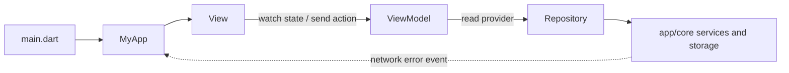

# myapp

## 1. Summary

`myapp` is a cross-platform Flutter application with Japanese as its base
locale. The application currently includes:

- State management and dependency injection with Riverpod.
- Navigation with AutoRoute.
- API communication with Dio and Retrofit.
- Local storage with SharedPreferences and Hive.
- Firebase Core, Cloud Messaging, and Crashlytics.
- Deep links, local notifications, QR/barcode scanning, and network status checks.
- Localization with Slang; the primary font is `NotoSansJP`.

## 2. Architecture

The app follows layered MVVM with Riverpod. `presentation/` contains Views,
ViewModels, UI state, and shared widgets; `domain/` contains business models,
repository contracts, and use cases; `data/` contains request/response models
and repository implementations. Cross-cutting infrastructure such as networking,
preferences, Firebase services, navigation, and localization remains in `app/`.
See [docs/architecture_MVVM-Riverpod.html](docs/architecture_MVVM-Riverpod.html)
for the detailed folder and naming conventions. The structure follows the
principles in the [official Flutter app architecture guide](https://docs.flutter.dev/app-architecture/guide):
separation of Views/ViewModels and Repositories/Services, unidirectional data
flow, and immutable UI state. This source base keeps Domain contracts as an
explicit dependency boundary; use cases are optional and should be added when
business logic is complex, combines repositories, or is reused.

```text
lib/
├── main.dart
├── app/
│   ├── core/                 # Network, preferences, platform services, resources
│   ├── language/             # App-wide language state
│   ├── providers/            # Composition root for Domain and Data
│   ├── routers/              # AutoRoute configuration and generated routes
│   └── app.dart              # Root app composition and global UI event handling
├── domain/
│   ├── models/               # Plain business models
│   ├── repositories/         # Repository contracts
│   └── use_cases/            # Business actions
├── data/
│   ├── models/               # Request/response models for data sources
│   └── repositories/         # Repository implementations (*_impl.dart)
├── presentation/
│   ├── home/                 # Design-system showcase: views/, view_models/, widgets/
│   ├── onboarding/views/
│   ├── setting/              # views/, view_models/, widgets/
│   ├── shell/                # views/, view_models/, widgets/
│   ├── splash/               # views/, view_models/
│   └── widgets/              # Shared buttons, inputs, dialogs, overlays
├── gen/                      # Generated asset/font references
└── i18n/                     # Slang translations and generated code
```

Each screen keeps its UI in `views/`, its presentation logic in `view_models/`,
and immutable Freezed state alongside its ViewModel. Small, short-lived widget
state can remain local instead of becoming a provider. Data models exchanged
with APIs or storage use explicit `*_request.dart` / `*_response.dart` names;
business models in `domain/models/` keep the business concept name without
transport or serialization suffixes. UI-only models belong in `presentation/`.
The existing `User` model is a known exception: it still contains JSON
serialization while being declared in Domain; move that mapping into Data when
the local persistence flow is next refactored.

The Home screen is currently a design-system showcase, not a product catalog.
Product has a Domain model, repository contract, and use case, but does not yet
have a Data implementation, remote service, or end-to-end UI flow.

### Dependency direction

```text
View -> ViewModel -> Use Case (when needed) -> Domain Repository contract
                                             <- Data Repository implementation
                                                -> data service / app/core platform service
```

Views watch state and send user actions to ViewModels. ViewModels obtain data or
perform app actions through use cases or repository providers. Domain contracts
do not depend on Data; `app/providers/` wires each contract to its Data
implementation. Data repositories map source-specific request/response objects
to Domain models and coordinate data services or shared platform services in
`app/core/services/`. A feature-specific API/storage service generally belongs
in `data/services/`. View and ViewModel never call these services directly.
For simple actions, a ViewModel can depend on a Repository without a Use Case;
repositories are the source of truth for application data and should not depend
on other repositories.
Shared UI belongs in `presentation/widgets/`; `app/core` stays independent of
presentation code.
Global network errors are published as app-level events and rendered as toast
UI by the root app. Shell-level network and deep-link handling remains in the
shell presentation.

`HomeViewModel`, `SettingViewModel`, and `AppShellViewModel` use explicit
`NotifierProvider`s. Other infrastructure and generated models may use code
generation. Do not edit generated files by hand.

### Example feature flow

The implemented `skipUpdate` action demonstrates the full local-data path; it
does not make a server request:

```text
ModalUpdateAppWidget
  -> AppShellViewModel.skipUpdate()
  -> skipUpdateUseCaseProvider (app/providers/app_providers.dart)
  -> SkipUpdateUseCase (domain/use_cases/)
  -> AppUpdateRepository (domain contract)
  <- AppUpdateRepositoryImpl (data/repositories/)
  -> PrefsLocalStorage.skipUpdate() (app/core/services/)
  -> AppShellState.doNotShowAgain is updated
```

The app-version response and Domain model are separated, but version checking
is not yet connected to an API/repository; `AppShellViewModel.checkVersion()`
is currently a stub.

### Startup flow

1. `main.dart` initializes the Flutter binding and error handlers.
2. The environment file, SharedPreferences, and Hive are initialized.
3. `ProviderContainer`, deep links, and the language provider are initialized.
4. `MyApp` runs inside `UncontrolledProviderScope` and `TranslationProvider`.



### Testing

Unit tests cover ViewModel state transitions, repository behavior, and use-case
delegation; widget tests cover rendered UI and interactions. Override providers
with fakes so tests do not make real network calls. For example, the initial
home state can be checked without building a widget:

```dart
import 'package:flutter_test/flutter_test.dart';
import 'package:hooks_riverpod/hooks_riverpod.dart';
import 'package:myapp/presentation/home/view_models/home_view_model.dart';

void main() {
  test('starts with loading state and no products', () {
    final container = ProviderContainer.test();

    final state = container.read(homeViewModelProvider);

    expect(state.isLoading, isTrue);
    expect(state.products, isEmpty);
  });
}
```

`ProviderContainer.test()` disposes the container after the test. Widget and
integration tests are still needed for navigation, rendering, and native plugin
behavior. Run `flutter test` to execute the complete test suite.

### Lifecycle and memory leaks

- Prefer auto-disposed providers; use `keepAlive` only when there is a clear reason.
- Dispose subscriptions, timers, controllers, sockets, and owned resources with `ref.onDispose`.
- Use `ref.watch`/`ref.listen` within provider or UI lifecycles; do not register subscriptions repeatedly in `build`.
- Cancel requests when a provider is disposed if supported; do not retain `BuildContext` or widgets in singletons.
- Dispose `ProviderContainer` instances in tests and dispose manually created containers when their owner ends.

`NetworkController` demonstrates cancelling subscriptions with `ref.onDispose`.
The app container is created once in `mainCommon()` and owned by
`UncontrolledProviderScope` for the application's lifetime.

## 3. CLI config and setup

### Requirements

- Flutter compatible with Dart SDK `^3.13.1`.
- Android Studio or Xcode, depending on the target platform.
- CocoaPods for iOS/macOS development.
- Firebase CLI/FlutterFire CLI if Firebase configuration needs to be regenerated.

### Installation

```bash
flutter pub get
```

Use `fvm flutter ...` instead if the project is managed with a locally
configured Flutter Version Management (FVM) SDK.

Create a `.env` file before running the application. `main.dart` currently
calls `dotenv.load(fileName: '.env')` directly. The `AppFlavor` enum defines
mappings for `.env`, `.env.stg`, and `.env.prod`, but flavor-based file selection
is not currently connected to the entry point. Check all required environment
variables and do not commit secrets.

Generate code for Retrofit, Freezed, Riverpod, and other generators:

```bash
dart run build_runner build --delete-conflicting-outputs
```

Generate or watch translation files:

```bash
dart run slang
# Watch for changes during development:
dart run slang watch
```

Native Firebase configuration is stored in `android/app/google-services.json`
and `ios/Runner/GoogleService-Info.plist`. Regenerate the Dart configuration with:

```bash
flutterfire configure
```

## 4. Run

List available devices and emulators:

```bash
flutter devices
```

Run the app in debug mode:

```bash
flutter run
```

Run on a specific device:

```bash
flutter run -d <device-id>
```

Common build commands:

```bash
flutter build apk --debug
flutter build appbundle --release
flutter build ios --release
```

The `development`, `staging`, and `production` flavors are defined in
`AppFlavor`. However, the entry point currently calls
`mainCommon(AppFlavor.production)` by default. To run another flavor, update
the entry point or add a flavor-selection mechanism before using flavor-specific
build commands.

Run checks:

```bash
flutter analyze
flutter test
```

## 5. Version

Current package version information from `pubspec.yaml`:

| Component | Value |
| --- | --- |
| App version | `1.0.0` |
| Build number | `1` |
| Dart SDK constraint | `^3.13.1` |
| Flutter SDK | Required; version is not pinned in this repository |

The build version can be overridden during the build:

```bash
flutter build apk --build-name=1.0.0 --build-number=1
```

## 6. Sources

- [Flutter documentation](https://docs.flutter.dev/)
- [Dart documentation](https://dart.dev/guides)
- [Riverpod](https://riverpod.dev/)
- [AutoRoute](https://pub.dev/packages/auto_route)
- [Dio](https://pub.dev/packages/dio)
- [Retrofit for Dart](https://pub.dev/packages/retrofit)
- [Slang](https://pub.dev/packages/slang)
- [Firebase for Flutter](https://firebase.google.com/docs/flutter/setup)
